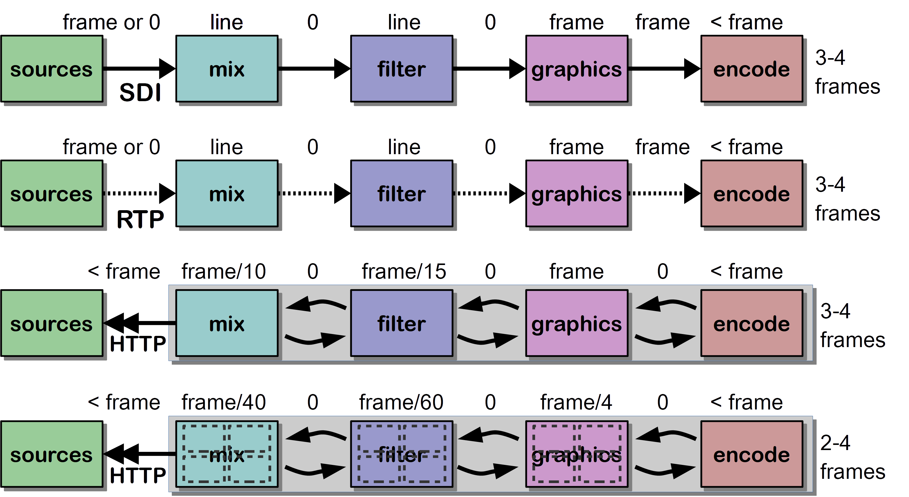

# Arachnid
## DRAFT v5!

Streampunk Media's draft specification of HTTP(S)-based transport of NMOS grains and flows over the world-wide-web. This specification is a prototype and is not yet complete. It is being developed in parallel with a Node.js implementation as `spm-http-in` and `spm-http-out` nodes in [node-red-contrib-dynamorse-http-io](/Streampunk/node-red-contrib-dynamorse-http-io). The primary benefit of this approach is that, with appropriate TCP window size/scale settings, streams will scale to fill available network pipes with standard operating system kernels and cloud platforms. This allows a user a runtime choice to trade a few grains of latency for more reliability, better bandwidth utilisation, back pressure, security and de facto internet-backed routing (no need for STUN/TURN/ICE). Grains may also be sub-divided into fragments, providing the ability to benefit from this approach and maintain lower latency with larger grain sizes.

The aim of the specification is to efficiently transport JT-NM _grains_ - PTP time stamped video frames, chunks of audio samples or data/event media data - using parallel and overlapped HTTP requests. Transport takes place as fast as the network can carry the underlying packets and may be faster than real time. The specification supports push and pull modes, with a choice of unsecure HTTP or secure HTTPS protocols. The headers are common to both methods.  Receivers can pace their requests and senders may slow down the speed of their response to real time or slower. In this way, back pressure can be applied between processing endpoints.

As a consequence of this approach, grains of a media stream do not necessarily travel in the order that they are presented and the packets on the wire will be an interleaved mix of different grains from the same flow. Clients may need to have a small buffer to re-order up to a few frames or fragments. This approach relies on a strong identity and timing model, as described in the JT-NM reference architecture. This is a different approach from a linear signal but an approach that scales well in IT networks.



This is not an approach that supports line-synced timing and may not be appropriate for live sports action that requires extremely low latency. However, for many current SDI workflows that can tolerate a small delay, this approach is sufficient. Where framebuffers are part of a workflow anyway, along with in-memory resource mapping and parallel code execution, the approach may even lower latency over a real-time stream. With HTTP keep alive, TCP and TLS negotiation can be done up front, meaning that after initialisation this does not have a significant impact on latency.

## Headers

### Grain-specific headers

Mapping of the grain logical model to HTTP headers. 

* `Arachnid-PTPOrigin` - PTP timestamp in `<secs>:<nanos>` notation.
* `Arachnid-PTPSync` - PTP timestamp in `<secs>:<nanos>` notation.
* `Arachnid-Timecode` - SMPTE 12M Timecode formatted in `HH:MM:SS[:;]FF` notation. (optional)
* `Arachnid-FlowID` - UUID formatted in `xxxxxxxx-xxxx-xxxx-xxxx-xxxxxxxxxxxx` notation
* `Arachnid-SourceID` - UUID formatted in `xxxxxxxx-xxxx-xxxx-xxxx-xxxxxxxxxxxx` notation
* `Arachnid-GrainType` - Enumeration of `video`, `audio`, `data`. (optional)
* `Arachnid-GrainDuration` - Rational number in `<numerator>/<denominator>` format - fraction of a second. (optional)
* `Arachnid-Packing` - (optional) FourCC code or equivalent representing the packing of uncompressed samples into the stream. 

The use of a packing parameter enables data to be transported in the format in which it was produced or consumed, such as the commonly used [V210 format](https://developer.apple.com/library/content/technotes/tn2162/_index.html), without bitwise transformation only used for transportation.

`Content-Type` shall be set to the registered MIME type, e.g. `video/raw` or `audio/L16`. Additional parameters shall be specified according to the defining RFC, for example:

`Content-Type: video/raw; sampling=YCbCr-4:2:2; width=1920; height=1080; depth=10; colorimetry=BT709-2; interlace=1`

`Content-Type: audio/L16; rate=48000; channels=2`

`Content-Length` must be provided so that a receiver can pre-allocate suitable buffers. However, it is expected that larger grains will be delivered as defined lumps.

### Arachnid protocol headers

PTP timestamps shall always contain nine digits to specify the nanosecond value and shall be zero-padded if the value could be written with less digits.

Note: The original draft of this specification had a substantially more complex set of headers for thread management. Implementation work suggested that these are not required and so the `ThreadNummber`, `TotalConcurrent` and `NextByThread` have been removed. 

#### Maximum number of parallel streams

In common with the established limitation for web browsers, no more than 6 parallel requests should be made for content for the same flow. Many firewalls and servers are configured to treat more than six concurrent requests for content between client and server as a denial of service attack.

## URLs

### Absolute resource references

URLs take the form of a base path and either the grain's origin time stamp or relative time to now. The URL should contain the flow identifier or label, but this is not mandatory. For example, an explicit grain reference:

`http://clips.newsroom.glasgow.spm.co.uk/flows/4223aa8d-9e3f-4a08-b0ba-863f26268b6f/1466371328:891000000`

The base path could be specified as the `manifest_href` path of the associated NMOS registration and dicovery API sender object or equivalent, tbd. The base path is the path without the time stamp, for example:

`http://clips.newsroom.glasgow.spm.co.uk/flows/4223aa8d-9e3f-4a08-b0ba-863f26268b6f/`

### Time-relative resource references

Time-relative references take the form of a `start` path and path parameters specifying a means to be redirected to the grain that relates to the current time at the server measured in grain counts. Designed to allow a number of parallel threads at a client to start a consistent set of requests, the path parameters are `.../start/<start_id>/<thrreads>/<thread_idx>`:

* `<start_id>` to group a set of requests which are made concurrently by a single client within a five second window; 
* `<threads>` to specify the total number of threads;
* `<thread_idx>` providing the thread index number (1-based). 

For example, `.../start/sid42/4/4` is the most recently emitted grain of a flow from a sender for a client expecting to be able to make four parallel requests. `.../start/sid42/4/1` is a four frames back from from the head of the stream at the point that the request for the given `start_id` is made.

For a single thread:

`http://clips.newsroom.glasgow.spm.co.uk/flows/4223aa8d-9e3f-4a08-b0ba-863f26268b6f/start/sid4321/1/1`

### Fragmented grains

Implementations may support the sub-division of grains into equal sized fragments. To do this, append the number of fragments to divide the grain into and the one-based index of the part to the end of the path. For example, to subdivide a grain into four pieces and pull the second piece, use the following path:

`http://clips.newsroom.glasgow.spm.co.uk/flows/4223aa8d-9e3f-4a08-b0ba-863f26268b6f/1466371328:891000000/4/2`

Where the content length of a grain does not exactly sub-divide by an integer value, in and out indexes should be rounded down to the nearest value. The last fragment must contain all remaining bytes. For example, for a grain with content length 1601 subdivided into 4 parts:

* Part 1 contains bytes 0 to 399.
* Part 2 contains bytes 400 to 799.
* Part 3 contains bytes 800 to 1199.
* Part 4 contains bytes 1200 to 1601.

An implementation that does not support grain fragmentation should return a [501 Not Implemented](https://http.cat/501) status code.

## Pull 

In pull mode, a receiver is a client that makes HTTP GET requests of a sender that is an HTTP server.

Senders may cache every grain of a flow or may have a limited cache of, say, 10-30 grains. This is entirely configurable by use case. If a receiver happens to know the grain timestamps of a running flow, it could start to make explicit requests for grains directly. It may get a cache hit or miss, depending on the size of the cache. The assumption is that most of the time, a receiver wants to get the grains that most recently flowed. To achieve this, the protocol supports an optional startup redirection phase followed by requests for explicit grains.

### Startup redirection phase

The receiver starts by making one of more relative get requests of the sender as it does not yet know the timestamps in the stream, for example with 4 parallel threads of transport the receiver requests grains `.../start/sid42/4/1`, `.../start/sid42/4/2`, `.../start/sid42/4/3` and `.../start/sid42/4/4`. For the last one of these, the server responds with a [302 found](https://http.cat/302) response with the `location` header containing the path of the grain with the highest timestamp _t_, for example `40:120000000`. For request `.../start/sid42/4/3` the location header is _t_ - _d_ - where _d_ is grain duration - which is `40:080000000`, for `.../start/sid42/4/2` it is _t_ - 2 * _d_ which is `40:040000000` etc..

The consistency of timestamps across requests must be common to a given start ID within 5 seconds of the first requests being received.

To complete the example, here are the example request and response headers (with the first fairly complete):

```
GET http://clips.newsroom.glasgow.spm.co.uk/flows/4223aa8d-9e3f-4a08-b0ba-863f26268b6f/start/sid42/4/1 HTTP/1.1
...

HTTP/1.1 302 Found
...
Location: 40:000000000
...
```

```
GET http://clips.newsroom.glasgow.spm.co.uk/flows/4223aa8d-9e3f-4a08-b0ba-863f26268b6f/start/sid42/4/2 HTTP/1/1
...

HTTP/1.1 302 Found
...
Location: 40:040000000
...
```

```
GET http://clips.newsroom.glasgow.spm.co.uk/flows/4223aa8d-9e3f-4a08-b0ba-863f26268b6f/start/sid42/4/3 HTTP/1/1
...

HTTP/1.1 302 Found
...
Location: 40:080000000
...
```

```
GET http://clips.newsroom.glasgow.spm.co.uk/flows/4223aa8d-9e3f-4a08-b0ba-863f26268b6f/start/sid42/4/1 HTTP/1/1
...

HTTP/1.1 302 Found
...
Location: 40:120000000
...
```

The pull client then follows the redirection paths, which may be relative or absolute, and makes GET requests for the frame data. For example, one of these requests might be:

```
GET http://clips.newsroom.glasgow.spm.co.uk/flows/4223aa8d-9e3f-4a08-b0ba-863f26268b6f/40:080000000 HTTP/1/1
...

HTTP/1.1 200 OK
...
Arachnid-PTPOrigin: 40:080000000
Arachnid-PTPSync: 40:080000000
Arachnid-Timecode: 10:00:00:02
Arachnid-FlowID: 4223aa8d-9e3f-4a08-b0ba-863f26268b6f
Arachnid-SourceID: 26bb72a1-0112-495d-81ab-f5160ca69015
Arachnid-GrainType: video
Arachnid-Packing: YUYP
Arachnid-GrainDuration: 1/25
Content-Type: video/raw; sampling=YCbCr-4:2:2; width=1920; height=1080; depth=10; colorimetry=BT709-2; interlace=1
Content-Length: 5184000
...
< body is a stream of essence payload for the grain >
```

### Running phase

In the example, subsequent requests by thread are made to `.../40:160000000`, `.../40:200000000`, `.../40:240000000` and `.../40:280000000`, and not to `.../start/sid42/4/5`, `.../start/sid42/4/6`, `.../start/sid42/4/7` etc..

The client is responsible for calculating the PTP timestamp of the next frame that it requires. For a single-threaded implementation, this will be the returned `...-PTPOrigin` timestamp from the header plus the grain duration. This may be computed from the `GrainDuration` header or from knowledge of the media type. For concurrent connections, each thread may request a timestamp that is an increase in time over the previously received timestamp by the product of the number of threads by the grain duration. 

Servers should be tolerant to a small range of timestamps around the actual grain timestamp to allow for rounding errors. This should be at least 1% of the grain duration either side of the given timestamp and no more than 10%. For example, the grain at timestamp `.../40:280000000` can also be referenced with timestamps plus or minus 1/2500 of a second, i.e. in the range `.../40:279600000` to `.../40:280400000`.

For irregular event data where a grain duration cannot be provided, the client should use time-relative resource references and poll. This may not be the most efficient approach and another method beyond the scope of this specification, such as a websocket-based protocol, could be considered.

Servers should answer requests for relative grains as follows:

* Servers should answer requests for relative frames within a range of plus or minus ten grains, or the HTTP timeout for the platform, whichever is the shorter time. Note that long-GOP grains may have a grain duration of some seconds.
* Requests for grains that were cached but that are no longer available should produce a [410 Gone](https://http.cat/410) HTTP response - the resource has gone from this base path and will not be available again.
* Requests for grains that are too far in the future should be answered with a [404 Not Found](https://http.cat/404) response code as the grains may become available if requested again in the future.

For real time streams, requests should be made at a real time cadence for the grains and the client should tolerate a [404 Not Found](https://http.cat/404) response for the case where it is ahead of the game, retrying the requests a few times with a short delay inbetween until a [200 OK](https://http.cat/200) response is then received. 

### Multiple clients vs backpressure

A pull server may be configured in two ways:

1. Running its own internal clock and allowing multiple clients to make requests for the grains.
2. Using the pull rate of the client to apply backpressure from the client to the streaming content source of the server. In this mode, multiple clients can still be supported with the client that has pulled the grain with the highest timestamp driving the back pressure.

In the first mode, clock drift between client and server over time may mean that clients fall off the back of the available grains. In the second mode, a stream can run faster then or slower than real time across computers, controlled by back pressure from the ultimate consumer.

### Ending the stream

Once the stream has finished, instead of returning [404 Not Found](https://http.cat/404) for a request for a timestamp ahead of the most recently available grain, a status of [405 Method Not Allowed](https://http.cat/405) shall be returned. The response shall include an `Allow` header with no entries. This indicates that the `GET` method will never be supported for the reosurce because the stream has ended at an earlier timestamp.

## Push

In push mode, a sender is a client that makes HTTP `PUT` requests to a receiver that is an HTTP server. This approach may be useful when uploading content through a firewall to an external location, such as a cloud server.

### Sending grains ###

The sender uses the HTTP `PUT` method to send grains or fragments of grains to the receiver using absolute resource references. Grains may be fragmented and this is inidcated by the path of the `PUT` method. The arachnid headers must be set for the `PUT` request. Grains are idempotent and can be safely retransmitted in the event of failure.

In general, grains should be sent in sequence, one-after-the-other, in the same order as their time stamp and should be sent without gaps or omissions. It is the receiving server that is responsible for recreating a continuous stream and the receiver can only do this if the sender is well behaved, within the tolerance of a cache. 

More than one grain may be sent at a time, allowing for parallel transport of the stream. 

### Receiving grains ###

The server is set up to receive `PUT` requests at the base path, with the end of the path used as path parameters to indicate which grain or grain fragment is being received. The client starts to send grains of grain fragments in sequence or in parallel. No opening message is required and the server establishes high and low watermarks based on the initial grains received. The server responds with a [200 OK](https://http.cat/200) message containing a JSON message confirming the number of bytes streamed and the current length of the queue at the server.

```
PUT http://clips.newsroom.glasgow.spm.co.uk/flows/4223aa8d-9e3f-4a08-b0ba-863f26268b6f/40:080000000 HTTP/1/1
Arachnid-PTPOrigin: 40:080000000
Arachnid-PTPSync: 40:080000000
Arachnid-Timecode: 10:00:00:02
Arachnid-FlowID: 4223aa8d-9e3f-4a08-b0ba-863f26268b6f
Arachnid-SourceID: 26bb72a1-0112-495d-81ab-f5160ca69015
Arachnid-GrainType: video
Arachnid-Packing: V210
Arachnid-GrainDuration: 1/25
Content-Type: video/raw; sampling=YCbCr-4:2:2; width=1920; height=1080; depth=10; colorimetry=BT709-2; interlace=1
Content-Length: 5529600
...
< body is a stream of essence payload for the grain >

...
HTTP/1.1 200 OK
...
Content-Type: application/json
Content-Length: 50

{
  bodyLength: 5529600,
  receiveQueueLength: 7
}

```

The server may receive grains out of order and so must keep a sorted cache of grains so that, with an appropriate delay, grains can be sent onwards in order.

The protocol does not specify the details of how the sorting is done or recommend a mechanism. In a fast and reliable network when transporting a live stream - where grains fragments are transmitted many times faster than real time - the need for a sorted cache is significantly reduced. The following codes can be used to help:

* In the event that the servers cache is full and cannot accept and more grains, the server may send a [429 Too Many Requests](https://http.cat/429) HTTP response indicating that the client is going too fast.
* If a server receives the same grain twice and already has a copy of a given grain in its cache, it should send a [409 Conflict](https://http.cat/409) HTTP response.
* If the server receives a grain with a timestamp that is before its low water mark, i.e. it has already processed grains with higher timestamps, it should respond with a [400 Bad Request](https://http.cat/400) HTTP response.

### Back pressure ###

The speed that data is streamed for each grain message body can be used to apply back pressure on the stream, along with delaying the sending of grains when [429 Too Many Requests](https://http.cat/429) are received. For example, if sending grains in sequence, the next back pressure _pull request_ should only be made once the previous `PUT` request has completed and a period equivalent to the grain duration has elapsed.

To scale, a intermediate caching agent can be introduced that receives the `PUT` requests from the sending client and allows the most recently received grains to be pulled with `GET` requests.

### Ending the stream ###

The stream is ended by a `PUT` request to the path of the last grain in the stream appended with `.../end` that the message is sent after the grain last grain has completed its response. For example, for a last grain at timestamp `44:080000000`:

```
PUT http://clips.newsroom.glasgow.spm.co.uk/flows/4223aa8d-9e3f-4a08-b0ba-863f26268b6f/44:080000000 HTTP/1/1
...
```
is, on completion, followed by:
```
PUT http://clips.newsroom.glasgow.spm.co.uk/flows/4223aa8d-9e3f-4a08-b0ba-863f26268b6f/44:080000000/end HTTP/1/1
<no body>
```

Note that for concurrent streams, the receiver may have to manage reordering the grains it recieves and ensuring that the all grains prior to the last one are received and sent onwards.

## Protocol - HTTP and HTTPS

HTTP or HTTPS (HTTP over TLS) protocols shall be supported. For HTTPS, a server will require certificates to be managed set up in the standard way for TLS/SSL security. Content will then be be encrypted between endpoints. Details of certificate management and security management is beyond the scope of this specification.

### Test code

Some test code for transporting grains in parallel can be found in the [netadaon](/Streampunk/netadaon) project. See the [`scratch`](/Streampunk/netadon/tree/master/scratch) folder. This code should migrate into this project as stand alone test and demonstration of the arachnid protocol.

## Comparison to other protocols

Why not use MPEG-DASH, HLS or similar? The design goal of this protocol is to avoid the use of pre-allocation and manifests and to encourage the use of parallel transport as a good alternative to RTP in a data centre. In particular, the application of this protocol is intended for optimal high-bitrate, failry low-latency transport of uncompressed and lightly compressed streams at one quaility level whereas MPEG-DASH and HLS support lower-latency, lower-bandwidth transport of adaptive bitrate streams - arguably a different use case.

However, this is a journey and it is entirely possible that this protocol will morph into something like MPEG-DASH. Watch this space!

## Next steps and future

### Specification 

Arachnid is labelled as _Streampunk Media arachnid_ to make it clear that this is not an AMWA or NMOS RFC or specification at this time. This is intended as an open specification and will be offered to the AMWA as an RFC as soon as it is sufficiently mature. At some point, it may be appropriate to replace the term `arachnid` with something more appropriate.

Implementation is ongoing. Further details to follow. For more information or if you have questions, contact the author Richard Cartwright (spark@streampunk.media).

### Logical cables

Recent refactorings have introduced the means to collect together related flows for essence, such as synchronized audio and video, into _logical cable_ groupings, which have shared back pressure. A means to use arachnid to transport all of the elementary flows contained within logical cable will be designed and provided. Flows on cables may be bidirectional. This will enable interconnection of related flows across a workflow that is deployed to a cluster of computers.

### Intermediate agent hubs

Investigation will be carried out of the use of _intermediate agent hubs_ that can receive push streams and allow them to be pulled, creating transport services that work and scale like the web, requiring minimal firewall configuration.

## License

This specification is released under the Apache 2.0 license. Copyright 2017 Streampunk Media Ltd.
